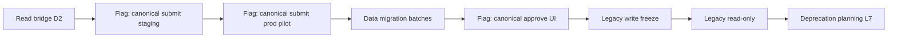

# P18-D3 — Canonical Leave UI Cutover Plan

**Date:** 2026-05-19  
**Type:** Planning only — no production cutover in P18-D3.

**Baseline:** P18-D2 bridge (canonical-first read, legacy write).

---

## A. Self-service cutover (`hr-me-leave.tsx`)

| Step | Current (D2) | Target (D4) | Rollback |
|------|--------------|-------------|----------|
| History list | `GET /hr/leave-requests` via bridge | Same (already canonical) | N/A |
| Policy picker | `GET /hr/me/leave-policies` | Same | N/A |
| Submit | `POST /hr/me/leave-requests` (legacy) | `POST /hr/leave-requests` with `leavePolicyId` | `VITE_CANONICAL_LEAVE_SUBMIT=false` → legacy POST |
| Status UI | `pending_approval`, `withdrawn` | Add withdraw button → `PATCH .../withdraw` | Hide withdraw if flag off |
| Balances display | Legacy balance APIs | Canonical balance read (existing `GET /hr/me/leave-balances`) | Revert fetch URL |

### Submit transition checklist

1. Enable `CANONICAL_LEAVE_SUBMIT` in staging only.
2. Map form fields: `employeeNote` ← reason; require `leavePolicyId`; remove client `daysCount` (server computes `businessDaysCount`).
3. Handle 409 overlap and 422 insufficient balance messages in UI.
4. Smoke: one submit → row in `leave_requests` only; `hr_employee_leaves` count unchanged.

### Rollback plan

- Flip env flag OFF within 5 minutes.
- No DB rollback needed (single write path per request).
- Communicate: employees may see requests in canonical list only after submit cutover.

---

## B. Admin attendance cutover (`hr-attendance.tsx` leaves tab)

| Step | Current (D2) | Target (D4) | Rollback |
|------|--------------|-------------|----------|
| List | Canonical + legacy merge | Canonical primary; legacy read-only badge | `includeLegacyAdmin` toggle via flag |
| Approve/reject | Legacy `PATCH /hr/attendance/leaves/:id` for `source=legacy` | `PATCH /hr/leave-requests/:id/approve|reject` for canonical | `CANONICAL_LEAVE_APPROVE=false` |
| Mixed rows | Both sources visible | Dedup UI after migration (see § duplicate handling) | Re-enable legacy merge |
| Canonical pending | Warning badge (D3) | Approve/reject buttons when flag ON | Remove buttons |

### Canonical approve/reject wiring (P18-D4)

```text
approveLeave.mutate → PATCH /api/hr/leave-requests/{id}/approve  { comment? }
rejectLeave.mutate  → PATCH /api/hr/leave-requests/{id}/reject   { comment? }
```

**Authorization note:** API allows designated approver OR role `admin|super_admin|manager` — not `hr.manage` alone. UI must surface 403 clearly; consider aligning API with `canViewAllLeaveRequests` in P18-D4.

### Legacy approval shutdown

- After `LEGACY_LEAVE_FREEZE=true`: hide legacy approve buttons (already only on legacy rows).
- After migration: legacy rows terminal — buttons hidden by status.

### Duplicate rows handling

| Phase | UI behavior |
|-------|-------------|
| Bridge (D2–D3) | Show both; badge `Canonical` / implicit legacy; optional “possible duplicate” if same employee + overlapping dates (P18-D4 enhancement) |
| Post-migration | Legacy rows have `LRQ-MIG-{id}` in canonical; hide legacy row when canonical `requestNumber` matches migration prefix |
| Steady state | Canonical-only list; legacy tab read-only archive |

### Approval actions visibility

| Row type | Status | D3 | D4 (flag ON) |
|----------|--------|-----|--------------|
| legacy | pending | Approve / Reject | Hidden after freeze |
| canonical | pending_approval | Warning badge only | Approve / Reject |
| canonical | approved/rejected | None | None |

---

## C. Employee detail cutover (`hr-employee-detail.tsx` Leaves tab)

| Milestone | Read path | Write path |
|-----------|-----------|------------|
| D2 (now) | `fetchLeaveListBridge({ employeeId })` + legacy merge | `POST /hr/employees/:id/leaves` (HR legacy) |
| D4 | Canonical list only for active workspaces post-migration | HR submit via `POST /hr/leave-requests` on behalf (future) or HR portal canonical |
| D6 | Remove legacy fetch fallback | Legacy GET read-only for pre-migration history |

**Fallback removal timing:** Only after workspace migration report shows 100% eligible legacy rows migrated + 7-day zero new legacy writes.

---

## D. Cutover sequencing (recommended)



| Order | Activity | Gate |
|-------|----------|------|
| 1 | Read-only bridge | D2 complete ✓ |
| 2 | Canonical submit (ESS) | Write audit **PARTIAL** → GO in staging |
| 3 | Data migration (workspace batches) | Migration plan signed; backup taken |
| 4 | Canonical approvals (admin UI) | Approver resolution tested; no legacy pending |
| 5 | Legacy write freeze | Zero dual-write; flags documented |
| 6 | Legacy read-only | All approvals on canonical |
| 7 | Migration verification | Reconciliation report within tolerance |
| 8 | Final cleanup | Legal/compliance sign-off (out of scope P18-D3) |

---

## Feature flags (UI)

| Flag | Vite env | Controls |
|------|----------|----------|
| `canonicalLeaveRead` | `VITE_CANONICAL_LEAVE_READ` | Already default behavior in D2 |
| `canonicalLeaveSubmit` | `VITE_CANONICAL_LEAVE_SUBMIT` | Submit form endpoint |
| `canonicalLeaveApprove` | `VITE_CANONICAL_LEAVE_APPROVE` | Attendance approve/reject for canonical |
| `legacyLeaveFreeze` | `VITE_LEGACY_LEAVE_FREEZE` | Hide legacy actions / show banner |

**P18-D3:** All default **OFF**. No production enablement.

---

**Confirmation:** Plan only. No full UI cutover executed in P18-D3.
