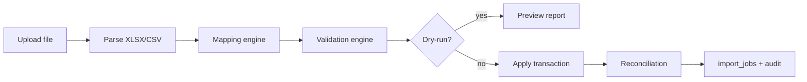

# P19-A — Import Processing Architecture

**Date:** 2026-05-19  
**Type:** Architecture foundation only.

---

## 1. Goals

Standardize **Excel/CSV import** across domains with validation, mapping, dry-run, reconciliation, and audit — reusing patterns proven in HR employee/attendance import.

---

## 2. Current state

| Import | Routes | Pattern |
|--------|--------|---------|
| HR employees | `GET import-template`, `POST import/preview`, `POST import/confirm` | Server preview + confirm |
| HR attendance | Same pattern | Client + server validation |
| Forms | File upload via storage presign | Not unified with import_jobs |
| Leave | No bulk import | — |
| Payroll | Not implemented | — |

**Gaps:** No central `import_jobs` table; no rollback of confirmed import; preview/confirm not reused as framework.

---

## 3. Pipeline architecture

```text
Upload → Parse → Map Columns → Validate → Dry-Run → Review UI → Confirm → Apply → Reconcile → Audit
```



---

## 4. Excel import pipelines

| Stage | Responsibility |
|-------|----------------|
| Parse | `xlsx` server-side; detect sheet; header row |
| Type coercion | Dates, numbers, enums |
| Row limits | Max 50k rows per job (configurable) |
| Error aggregation | First 100 errors + summary counts |

---

## 5. Domain imports

### Attendance import

- Match `employee_number` → `employees.id`
- Validate date, status enum, time formats
- Duplicate key: `(employee_id, date)` → update vs skip policy
- Align with existing `hr-attendance.tsx` import UI

### Employee import

- Extend current HR routes to `import_jobs` wrapper
- Org unit / job title resolution
- Duplicate: email, employee_number

### Future: leave balance import

- Policy + year + entitled days
- No overlap with canonical leave requests

---

## 6. Validation engine

| Rule type | Example |
|-----------|---------|
| Required | `employee_number`, `date` |
| Format | ISO date, email |
| Reference | FK must exist in workspace |
| Business | No terminated employee for attendance present |
| Cross-row | No duplicate keys in file |

**Output:** `validation_result` JSON on `import_jobs` — errors[], warnings[], stats{}

---

## 7. Mapping engine

- **Template-defined** column map: file header → canonical field
- **Saved mappings** per workspace (`import_mapping_profiles` — future table or JSON on job)
- **Auto-detect** headers (fuzzy match) — optional P19-C

---

## 8. Duplicate detection

| Strategy | When |
|----------|------|
| Skip | Default for attendance duplicate day |
| Update | Explicit flag on confirm |
| Fail row | Strict mode |
| Report only | Dry-run shows duplicates without write |

---

## 9. Dry-run import

- `import_jobs.dry_run = true`
- No DB writes except job metadata
- Returns: `would_insert`, `would_update`, `would_skip`, `errors`
- UI: same as HR preview today

---

## 10. Reconciliation

Post-confirm:

- Row counts vs file
- Sample spot-check query
- Balance side-effects (if import affects balances)
- Export reconciliation report (XLSX) optional

---

## 11. Import audit

| Field | Stored |
|-------|--------|
| Who | `created_by_user_id` |
| When | timestamps |
| Source file | `storage_key` on job |
| Summary | `summary_json` |
| IP | optional on audit log |

---

## 12. Rollback / revert strategy

| Scope | Approach |
|-------|----------|
| **Dry-run** | No rollback needed |
| **Full import** | `import_jobs.revert_token` + soft-delete inserted rows where `import_batch_id` stamped |
| **Attendance** | Delete rows where `source_type=import` + `import_job_id` |
| **Employees** | **Hard** — revert only if no downstream FKs; otherwise manual HR review |
| **Policy** | Revert window 24h; admin permission `hr.manage` |

**P19-A:** Document only — no revert implementation.

---

## 13. Storage

- Uploaded import files: `{workspace_id}/imports/{job_id}/source.xlsx`
- Error reports: `{workspace_id}/imports/{job_id}/errors.xlsx`

---

**Confirmation:** No import framework code in P19-A.
