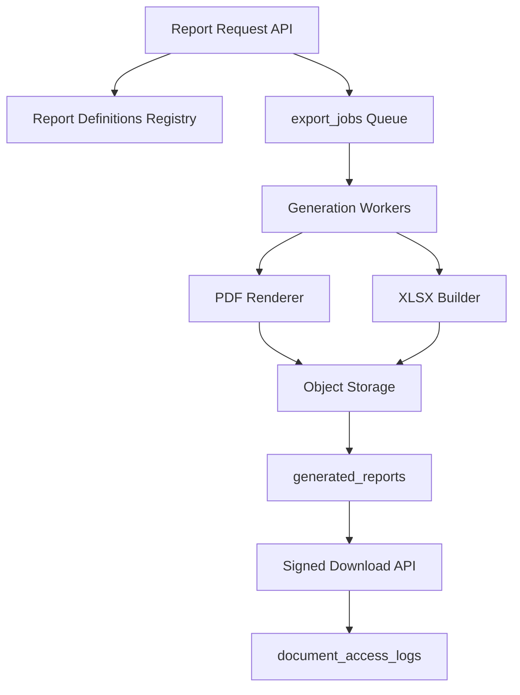

# P19-A — Reporting & Export Infrastructure

**Date:** 2026-05-19  
**Type:** Architecture foundation only.

---

## 1. Goals

- Unified **report definitions** across HR, payroll, attendance, governance
- **PDF** and **Excel** generation with async jobs for large datasets
- **Scheduled reports** via communication layer (P19-A communication arch)
- **Authorized download** with audit trail
- Workspace-scoped storage of generated artifacts

---

## 2. Current state

| Capability | Status | Location |
|------------|--------|----------|
| Excel export | Ad-hoc | `routes/hr.ts` — employees, attendance |
| CSV export | Ad-hoc | Same |
| Import template XLSX | Ad-hoc | HR import-template routes |
| PDF generation | **None** for reports | — |
| PDF storage | Upload only | Commercial/tenant billing invoices |
| `reports.view` permission | Defined | `workspace-roles.ts` — **no product** |
| Report UI | **None** | No `/reports` in `App.tsx` |

---

## 3. Target architecture

---

## 4. PDF generation

| Aspect | Decision |
|--------|----------|
| Engine | Headless Chromium (puppeteer) or dedicated PDF service — evaluate in P19-B |
| Templates | HTML + CSS per `report_definition_key`; workspace branding injection |
| Data binding | Server-side query → template context (no client-side PDF) |
| Payroll payslips | High priority consumer; strict layout versioning |
| Performance | Async only for > N rows or > 5s estimate |

---

## 5. Excel generation

| Aspect | Decision |
|--------|----------|
| Library | Continue `xlsx` / SheetJS for parity with imports |
| Large exports | Stream write; split sheets; `export_jobs` |
| Formatting | Header styles, column widths, optional macros disabled |
| Attendance | Daily grid + summary sheet |
| HR analytics | Pivot-ready flat tables phase 1 |

---

## 6. Scheduled reports

| Field | Description |
|-------|-------------|
| Schedule | Cron per workspace (timezone-aware) |
| Definition | `report_definition_key` + parameter JSON |
| Recipients | Users / roles / external emails (policy-gated) |
| Delivery | Email attachment via `notification_jobs` + link fallback |
| Storage | `generated_reports` retained per policy |

---

## 7. Report templates

- **Platform library:** Default templates (copy on workspace create)
- **Workspace override:** Optional custom HTML/CSS (sandboxed)
- **Versioning:** `template_version` on each run for reproducibility

---

## 8. Report storage

- Path: `{workspace_id}/reports/{job_id}/{filename}`
- Link: `generated_reports.storage_key`
- Expiry: `expires_at` + lifecycle job
- Access: Signed URL TTL 15 minutes; single-use optional

---

## 9. Export queues

| Job type | Sync threshold | Async |
|----------|----------------|-------|
| Employee list < 5k rows | Sync download | — |
| Employee list > 5k | — | `export_jobs` |
| Attendance month export | Usually async | Yes |
| Payroll run export | Always async | Yes |

**Worker:** DB polling or queue consumer; horizontal scale in P19-C+.

---

## 10. Large export handling

- Cursor-based DB reads (no full memory load)
- Progress: `export_jobs.progress_pct`
- Cancel: user-initiated → worker cooperative stop
- Failure: partial file discarded; error report JSON

---

## 11. Download authorization

1. User authenticated + `workspace_id` match
2. Permission: `reports.view` or domain-specific (`hr.view`, etc.)
3. `workspace_access_enforcement.allow_export` === true
4. Subscription policy: `allow_data_export_during_suspension` if suspended
5. Log to `document_access_logs`

---

## 12. Audit trail

| Event | Log |
|-------|-----|
| Report requested | `communication_audit_logs` or `export_jobs` |
| Generation complete | `generated_reports` row |
| Download | `document_access_logs` |
| Scheduled send | `notification_deliveries` |

---

## 13. Domain report catalog (initial)

| Key | Domain | Format |
|-----|--------|--------|
| `hr.employees.roster` | HR | XLSX |
| `hr.attendance.period` | Attendance | XLSX |
| `hr.leave.balances` | Leave | XLSX |
| `payroll.payslip.batch` | Payroll | PDF |
| `payroll.register` | Payroll | XLSX |
| `workspace.activity.summary` | Ops | XLSX |

---

**Confirmation:** No report engine implementation in P19-A.
