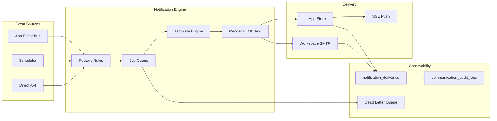

# P19-A — Workspace Communication Architecture

**Date:** 2026-05-19  
**Type:** Architecture foundation only — no implementation.

**Context:** Builds on P18 workspace boundary (`workspace_id`), event bus, in-app notifications, and env-based SMTP today.

---

## A. Workspace-owned communication infrastructure

Each **workspace** owns its outbound communication configuration. Platform operators may set defaults; workspaces override within policy.

| Asset | Owner | Description |
|-------|--------|-------------|
| SMTP configuration | Workspace | Host, port, TLS, credentials (encrypted), provider type |
| Sender identities | Workspace | `noreply@`, `hr@`, `payroll@` — verified domains where possible |
| Branding | Workspace | Logo URL, primary color, footer legal text, locale default |
| Email templates | Workspace | Versioned HTML/text per event type + locale |
| Notification preferences | Workspace + user | Channel toggles (in-app, email, digest), quiet hours |
| Scheduled reports | Workspace | Cron + recipients + report definition ref |
| Delivery policies | Workspace | Retry limits, rate limits, bounce handling rules |

**Platform layer (global):**

- Fallback SMTP for system mail (invites, platform ops) — separate from workspace SMTP
- Template library defaults (copy-on-create for new workspaces)
- Provider health monitoring

**Current state:** Single env SMTP (`artifacts/api-server/src/lib/email.ts`); `platform_settings` category `smtp` exists but is **not wired** to sender.

---

## B. Canonical communication domains

| Domain | Purpose | Primary consumers |
|--------|---------|-------------------|
| **Email** | Transactional + operational outbound | Invites, forms, leave, payroll slips |
| **Notifications** | Durable in-app delivery records | All modules via event bus |
| **In-app alerts** | Real-time UX (SSE) | Bell icon, `/notifications` |
| **Scheduled reports** | Time-based delivery of generated files | HR, payroll, attendance |
| **Workflow notifications** | Step/approval/sla reminders | Workflows engine |
| **Payroll delivery** | Payslip/report distribution | Payroll module (future) |
| **HR alerts** | Document expiry, probation, contract end | HR foundation |
| **Attendance alerts** | Import failures, anomaly thresholds | Attendance engine |

**Non-goals (P19-A):** Marketing email, newsletter, SMS (phase later).

---

## C. Communication flow architecture

**Stages:**

1. **Event** — `appEventBus` (leave.requested, form.submitted, etc.) or scheduled trigger
2. **Notification Engine** — Resolve recipients, workspace policy, user preferences, template id
3. **Queue** — Async job `notification_jobs` (status: pending → processing → sent | failed)
4. **Template Engine** — Merge variables; workspace branding; i18n (ar/en)
5. **Workspace SMTP** — Per-workspace transporter; never cross-workspace credentials
6. **Delivery tracking** — Row per channel in `notification_deliveries`
7. **Audit log** — Immutable `communication_audit_logs` for compliance

**In-app fast path:** Critical alerts may write `notifications` + SSE immediately, then enqueue email asynchronously.

---

## D. Workspace isolation rules

| Rule | Enforcement |
|------|-------------|
| SMTP credentials | Encrypted at rest; scoped by `workspace_id`; API never returns secrets |
| Template namespace | `workspace_id` + `template_key` unique |
| Job queue partition | Jobs carry `workspace_id`; workers filter |
| Delivery records | All queries include `workspace_id` |
| No shared email state | No global “sent folder” across tenants |
| Cross-workspace leakage | **Forbidden** — admin APIs must validate workspace on every read |
| User notifications | Add `workspace_id` to `notifications` (gap today — user-only scope) |

**Platform mail:** Uses `platform_smtp` config; must not use workspace SMTP for unrelated tenants.

---

## E. Delivery reliability

| Concern | Strategy |
|---------|----------|
| **Retries** | Exponential backoff (e.g. 1m, 5m, 30m); max 5 attempts per job |
| **Dead-letter** | `notification_jobs.status = dead_letter` + ops alert |
| **Throttling** | Per-workspace hourly cap; per-recipient rate limit |
| **Provider failures** | Circuit breaker per workspace SMTP; fallback to in-app only |
| **Queue strategy** | DB-backed queue (phase 1); optional Redis/BullMQ (phase 2) |
| **Idempotency** | `idempotency_key` on jobs (event type + entity id + channel) |
| **Bounces** | Webhook or IMAP poll (future); mark delivery failed; suppress address |

**Observability:** Correlate via `bus_event_id` (already on `notifications`) → extend to email deliveries.

---

## Integration with existing code

| Existing | P19 direction |
|----------|----------------|
| `notifications-bus.ts` | Becomes primary writer; add email enqueue |
| `lib/email.ts` | Refactor to `WorkspaceMailer` + platform mailer |
| `routes/stream.ts` | Unchanged SSE; fed from in-app path |
| `routes/notifications.ts` | Add workspace filter when column added |

---

**Confirmation:** Architecture only. No SMTP rollout in P19-A.
