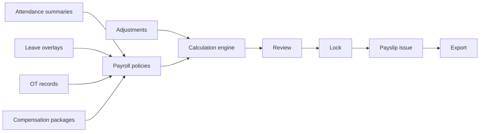

# P21-A — Payroll Calculation Pipeline

**Status:** Architecture specification — **not implemented in P21-A**

---

## 1. End-to-end flow



| Stage | Description | Mutations allowed? |
|-------|-------------|-------------------|
| **Gather inputs** | Load period, employees, packages, summaries | Yes (time data) |
| **Apply policies** | Proration, rounding, OT rules | Config only |
| **Calculate** | Produce `payroll_component_values` | Preview run |
| **Review** | HR validates exceptions | Adjustments |
| **Lock** | `payroll_locks` + run status `locked` | No time edits |
| **Payslip** | Issue PDF + employee notification | Immutable |
| **Export** | GL / bank / audit JSON | Read-only |

---

## 2. Input gathering (read-only adapters)

| Input | Query | Validation |
|-------|-------|------------|
| Period bounds | `payroll_periods` | `period_end` ≤ today for final run |
| Employees | active in workspace | Exclude terminated mid-period per policy |
| Package | `compensation_packages` active on period end | Error if missing |
| Summaries | `attendance_daily_summaries` WHERE date in period | Require lock check |
| Leave | `leave_requests` approved overlapping period | Map to paid/unpaid days |
| OT | `hr_overtime_records` status=approved, date in period, not yet paid | Mark `payroll_run_id` on include |
| Adjustments | `compensation_adjustments` effective in period | Approved only |

**Idempotency key:**

```
payroll:run:{workspaceId}:{periodId}:{runType}:v{policyVersion}
```

Duplicate POST with same key returns existing run.

---

## 3. Calculation steps (per employee)

1. Resolve **scheduled working days** from calendar/shift.  
2. Count **paid days** from summaries (present, paid holiday, paid leave).  
3. Count **unpaid absence** days.  
4. Prorate **fixed** components.  
5. Sum **approved OT** amounts (policy rate × hours).  
6. Apply **adjustments** (one-time + recurring).  
7. Apply **deductions** (unpaid, voluntary, statutory placeholder).  
8. Compute **gross**, **net** (tax stub in P21-C+).  
9. Persist `payroll_run_employees` + `payroll_component_values`.  
10. Generate payslip draft.

---

## 4. Recalculation rules

| Run type | Behavior |
|----------|----------|
| `preview` | Overwritable; no locks; no employee notification |
| `final` | Supersedes preview values; triggers review |
| `correction` | New run linked to `corrects_run_id`; delta lines only |

**Within same run (preview only):**

- Re-calculate employee: DELETE values for `run_employee_id`, re-run steps 1–10.
- Full run re-calc: allowed only in `draft` or `calculating` status.

**After lock:**

- No recalculation—instantiate correction run.

---

## 5. Lock behavior

| Lock type | Blocks |
|-----------|--------|
| `attendance` | Ingest, adjustments, replay for dates ≤ period_end |
| `payroll` | Run recalculation, package changes effective in period |
| `full` | Both |

Lock creation:

1. Validate no failed raw events in period (ops warning override).  
2. Set `payroll_periods.status = locked`.  
3. Insert `payroll_locks`.  
4. Set `payroll_runs.status = locked`.

**Break-glass:** super-admin + `break_glass_reason` logged.

---

## 6. Audit strategy

| Event | Log |
|-------|-----|
| Run started | `payroll.run.started` (future bus) |
| Employee excluded | reason code |
| Manual adjustment | user, before/after |
| Lock | user, period |
| Export | `report_access_logs` (existing P19) |

Store `input_snapshot_json` on `payroll_run_employees` at calculation time.

---

## 7. Retroactive changes

| Change type | Handling |
|-------------|----------|
| Late attendance punch for locked period | Blocked; correction run next period or break-glass |
| Retroactive salary increase | `compensation_adjustments` + correction run |
| Leave approved late | Reopen only if attendance lock open |

**Correction run** computes `delta_net` vs prior locked run; payslip shows adjustment section.

---

## 8. Legacy process mapping

| Legacy (`POST .../process`) | Canonical replacement |
|----------------------------|------------------------|
| Immediate `approved` | `review` → HR approve → `approved` |
| Structure-only math | Full input adapters |
| Delete/recreate payslips | Versioned `run_number` |
| Text amounts | Decimal columns |

**P21-A:** Legacy endpoint remains; flagged **non-production** in ops docs.

---

## 9. Failure handling

| Failure | Run employee status | Run status |
|---------|---------------------|------------|
| No package | `excluded` | `review` (warning) |
| Missing summaries | `error` | `calculating` → `review` |
| Policy exception | `error` | halt optional |

Partial success allowed: run completes with error rows for HR resolution.

---

## 10. Performance (P21-B+ notes)

- Batch employees in chunks (100).  
- DB job queue (existing `export_jobs` pattern)—**no Redis**.  
- Cache policy JSON per run.
