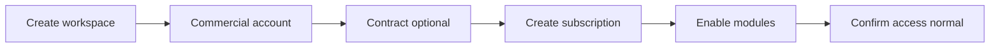

# Subscription Console Redesign (Recommendation Only)

**Target experience:** Enterprise SaaS Tenant Management — not an internal phase integration panel  
**Current page:** `/super-admin/tenants` → expand row → **Subscription** tab  
**Status:** Proposal only — **no implementation in this audit**

---

## 1. Problem statement (UX)

Operators today see:

- Eight summary cards duplicating overview data
- Accordion sections labeled **A)–F)** with phase terminology
- Two ways to edit “subscription” (registry metadata vs workspace state)
- Two “Entitlements” surfaces (tab vs accordion C)
- “Policy Evaluation” and “Apply Recommended Status” that suggest automation but require manual steps
- Contract linking in subscription form without visible contract lifecycle on the same screen
- Empty subscription state sections before a record exists
- Technical strings: `grace_period`, `platform.subscriptions.read`, “integration only”

**Desired mental model:**

1. **Who is this customer?** (tenant identity, region, account owner)  
2. **What did they buy?** (plan, subscription term, contract)  
3. **What can they use?** (modules/features, limits)  
4. **How is access today?** (operational mode — active, read-only, suspended)  
5. **What should we do next?** (renewal, review, manual actions) — optional advisory strip

---

## 2. Proposed information architecture

Replace single mega-accordion with **three top-level zones** and one advisory sidebar (desktop) or stacked (mobile).

```
┌─────────────────────────────────────────────────────────────┐
│  Tenant: Acme Corp · ID 42 · Region KSA                     │
│  [Commercial account ✓] [Subscription ● Active] [Access OK] │  ← status chips (human labels)
└─────────────────────────────────────────────────────────────┘

┌─ Plan & subscription ────────────────────────────────────────┐
│  Primary record (workspace_subscriptions — canonical)        │
│  Plan · Status · Term dates · Renewal · Linked contract      │
│  CTA: Edit subscription · Change status                      │
│  Empty: "No subscription — Set up plan" (single CTA)       │
└──────────────────────────────────────────────────────────────┘

┌─ Commercial agreement ───────────────────────────────────────┐
│  Active contract summary OR "No contract"                    │
│  CTA: Manage contracts (deep-link Commercial tab, anchored)  │
│  Inline: contract picker when editing subscription only      │
└──────────────────────────────────────────────────────────────┘

┌─ Product access ─────────────────────────────────────────────┐
│  Modules & features (merged view — one entitlement source)   │
│  Usage limits (quotas) — collapsed by default                │
└──────────────────────────────────────────────────────────────┘

┌─ Operational controls (advanced, collapsed) ────────────────┐
│  Workspace access mode (the only live enforcement)           │
│  Billing metadata (legacy P13 fields) — labeled "Registry"   │
│  Policy rules (advisory) — hidden until "Show policy rules"  │
└──────────────────────────────────────────────────────────────┘

┌─ Advisory (optional) ────────────────────────────────────────┐
│  "Recommendation: mark past due" — Apply · Dismiss           │
│  Clear copy: "Does not change access automatically"          │
└──────────────────────────────────────────────────────────────┘
```

### 2.1 Remove or relocate

| Current | Action |
|---------|--------|
| A) Subscription Overview + 8 cards | **Remove duplicate cards** — one header strip with 3–4 KPIs |
| Registry Subscription Management modal | **Merge** into “Plan & subscription” OR move to “Advanced → Registry metadata” |
| B) Subscription State | **Rename** → “Plan & subscription” (same APIs) |
| C) Entitlements & Features | **Merge** into “Product access” |
| D) Limits & Quotas | Subsection under Product access |
| E) Grace & Suspension Policy | **Advanced** — “Policy rules (advisory)” |
| F) Workspace Access Control | **Prominent** but labeled “Workspace write access” not “enforcement” |
| Entitlements tab (P13) | **Deprecate** — redirect to Product access with migration banner |

---

## 3. Naming map (user-facing)

| Today (technical) | Proposed label |
|-------------------|----------------|
| Subscription State | **Plan & subscription** |
| Subscription Management / Metadata | **Billing registry** (advanced) |
| Entitlements & Features | **Modules & features** |
| Limits & Quotas | **Usage limits** |
| Grace & Suspension Policy | **Renewal & suspension rules** (advisory) |
| Workspace Access Control | **Workspace access mode** |
| Policy Evaluation | **Health check** (advisory) |
| Access Mode | **Write access** |
| `grace_period` | **Grace period** |
| `past_due` | **Past due** |
| `active_contract_term_id` | **Linked contract** |
| integration only banner | **Internal note for admins** (collapsible, not hero) |

---

## 4. Workflows (target)

### 4.1 New tenant commercial onboarding



**UI:** Guided checklist at top of Subscription tab until complete (not separate wizard required for v1).

### 4.2 Create subscription (simplified)

1. Operator clicks **Set up subscription** (empty state).  
2. Modal sections (already improved): Info → Contract & dates → Notes.  
3. On success: land on Plan & subscription detail — no second “create” elsewhere.

### 4.3 Contract linking

- **Do not** imply contracts are created in subscription modal.  
- Picker shows contracts from Commercial tab with link **“Add contract in Commercial →”**.  
- Display contract status badge (Active / Draft / Expired).

### 4.4 Entitlements

- Single grid: module name, enabled toggle, source badge (Plan / Manual / Trial).  
- Remove duplicate P13 override modal or show overrides as rows in same grid.

### 4.5 Renewal / suspension (honest UX)

- Advisory strip: “Based on end date + rules, suggested status: Past due.”  
- Buttons: **Apply status** (opens reason modal) · **Adjust rules** (advanced).  
- Footnote always visible: “Does not block login or disable modules automatically.”

### 4.6 Workspace access (real control)

- Primary control when finance needs read-only: **Restrict workspace edits**.  
- Presets: Normal · Read-only · Suspended (view) · Terminated (view).  
- Show what each preset does in plain language (writes blocked yes/no).

---

## 5. Empty & error states

| State | Message | CTA |
|-------|---------|-----|
| No subscription | “This tenant has no subscription record.” | Set up subscription |
| No commercial account | “Link a commercial account before contracts or billing.” | Go to Commercial |
| No contract | “No contract linked — optional.” | Manage contracts |
| No entitlements rows | “Using default plan modules.” | Configure modules |
| P13/P16 mismatch | “Registry and subscription records differ — Review” | Open advanced |

---

## 6. Visual & interaction standards

- Use existing **Dialog**, **Select**, **Label** patterns (post recent Create Subscription fix).  
- Section padding: `p-4` bordered cards, not raw `text-xs` stacks.  
- Sticky modal footers for all modals.  
- One `sm:max-w-xl` for complex forms; `sm:max-w-md` for status change.  
- Dark mode: Radix Select only — no native `<select>` in tenant console.  
- Required fields: asterisk + inline errors (client-side before API).

---

## 7. Hierarchy on `/super-admin/tenants` (tabs)

| Tab | Keep? | Notes |
|-----|-------|-------|
| Overview | Yes | High-level chips only — link to Subscription for detail |
| Lifecycle | Yes | Workspace status — separate from subscription status |
| Commercial | Yes | **System of record for contracts** |
| Subscription | **Redesign** | This document |
| Entitlements | **Remove** (after merge) | Avoid duplicate |
| Usage / Renewal / Health / Evaluation | Keep in **More** | Power users; rename to plain language |

---

## 8. Permission UX

Instead of exposing `platform.subscriptions.read`, group capabilities:

| Operator capability | Sections shown |
|--------------------|----------------|
| View subscription | Plan & subscription (read) |
| Manage subscription | Create/edit/status |
| Manage product access | Modules + quotas |
| Manage workspace access | Access mode panel |
| View advisory | Policy/health read-only |

---

## 9. Phased rollout (recommendation)

| Phase | Deliverable | Risk |
|-------|-------------|------|
| **UX-1** | Rename sections, remove duplicate cards, empty states | Low |
| **UX-2** | Merge entitlements UI; deprecate Entitlements tab | Medium |
| **UX-3** | Collapse P13 metadata to Advanced | Medium |
| **ARCH-1** | Fix API shadowing + P13 route paths | High — backend |
| **ARCH-2** | Single subscription table migration | High |

**Do not start ARCH until product signs off UX-1 mock.**

---

## 10. Success metrics

- Operators can answer “Is this tenant active and what plan?” in **<10 seconds** without opening accordion.  
- Zero native `<select>` on Subscription tab in dark mode.  
- One create-subscription path, one edit path.  
- Contract workflow discoverable from Commercial tab in **one click**.  
- No UI copy promises auto-suspend/login block unless implemented.

*Implementation intentionally deferred. See `subscription-platform-final-recommendation.txt`.*
