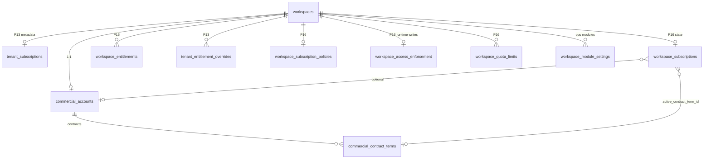

# Subscription Platform Architecture Audit

**Scope:** `/super-admin/tenants` and the commercial/subscription stack (P13–P17)  
**Date:** 2026-05-20  
**Mode:** Read-only discovery — no refactor executed  
**Workspace:** `data-core-main`

---

## Executive summary

The platform implements **two parallel subscription stacks** (P13 tenant registry metadata vs P16 workspace commercial subscription), **two parallel entitlement systems** (P13 overrides vs P16 workspace entitlements), plus **commercial contracts** (P15) that are real but **not wired into runtime enforcement**. The Subscription tab UI merges all of this into one accordion console, which exposes internal phase names, duplicate editors, and advisory “evaluation” flows that **look operational but are metadata-only**.

| Layer | Verdict |
|--------|---------|
| Canonical tenant identity | `workspaces` (API `tenantId` = `workspaces.id`) |
| Canonical commercial subscription (P16 intent) | `workspace_subscriptions` + related `workspace_*` tables |
| Legacy / registry subscription (P13) | `tenant_subscriptions` + derived status in tenant profile |
| Runtime write enforcement | **Only** `workspace_access_enforcement` via `workspaceAccessWriteGuard` |
| Entitlements runtime | **Not enforced** on operational routes (`canWorkspaceUseFeature` unused) |
| Quotas runtime | **Not enforced** (usage read + CRUD only) |
| Policy engine | **Advisory** (`evaluateSubscriptionPolicy`, `isAutomaticAllowed: false`) |
| Contracts runtime | **No gate** — link field on subscription only |
| Login blocking by subscription status | **Explicitly disabled** (`allowLogin=false` rejected in API) |

---

## 1. Entity map

### 1.1 Core identity

| Entity | Table / source | Role |
|--------|----------------|------|
| Tenant | `workspaces` | Customer org; all `tenantId` paths resolve here |
| Tenant registry profile | Built in `tenant-registry.ts` from workspace + P13 subscription + signals | List/detail UI on `/super-admin/tenants` |
| Platform user | `users` (`role=super_admin` for console) | Operators only on these routes |

### 1.2 Subscription (dual model)

| Entity | Phase | Table | UI surfaces |
|--------|-------|-------|-------------|
| Tenant subscription metadata | P13 | `tenant_subscriptions` | Registry row, Overview cards, **Subscription Management** modal, `Entitlements` tab profile |
| Workspace subscription state | P16-A | `workspace_subscriptions` | **Subscription State** panel, Create/Edit/Change Status modals |
| Tenant subscription visibility | P16-G | Read APIs `/tenant/subscription/*` | Workspace admin read-only (not super-admin console) |

**Critical API collision:** `GET` and `PATCH` `/api/platform/tenants/:tenantId/subscription` are registered in **`tenants.ts` (P13)** before **`workspace-subscriptions.ts` (P16)**. Express uses the first handler — **P16 GET/PATCH for the same path are shadowed**. `POST` create and `PATCH .../status` are P16-only (no P13 duplicate).

### 1.3 Contracts (commercial)

| Entity | Table | Parent |
|--------|-------|--------|
| Commercial account | `commercial_accounts` | 1:1 `workspace_id` |
| Contract term | `commercial_contract_terms` | `workspace_id` + `commercial_account_id` |
| Invoice / payment | `commercial_invoices`, `commercial_payment_records` | Linked to account/contract (manual records) |

Subscription link: `workspace_subscriptions.active_contract_term_id` → `commercial_contract_terms.id` (optional FK; no cross-workspace validation in DB).

### 1.4 Entitlements (dual model)

| Entity | Phase | Table | Resolver / API |
|--------|-------|-------|----------------|
| Plan-derived profile + overrides | P13-D | `tenant_entitlement_overrides` + plan in `tenant_subscriptions` | `deriveTenantEntitlementProfile`, `GET/PATCH …/entitlements` (**route path bug — see §6**) |
| Workspace entitlements | P16-B | `workspace_entitlements` | `workspace-entitlements.ts`, `workspace-entitlement-resolver.ts` |
| Module toggle (ops) | Core | `workspace_module_settings` + `platform_modules` | `modules.ts` — **separate from P16 entitlements** |

### 1.5 Quotas

| Entity | Table | Behavior |
|--------|-------|----------|
| Workspace quota limits | `workspace_quota_limits` | CRUD + usage computation — **no write blocking** |

### 1.6 Policy & access

| Entity | Table | Behavior |
|--------|-------|----------|
| Subscription policy | `workspace_subscription_policies` | Grace/suspension day counters; `enforcement_mode` stored |
| Policy evaluation | Pure function `evaluateSubscriptionPolicy` | Returns recommendations — **does not apply** |
| Workspace access enforcement | `workspace_access_enforcement` | **Only runtime lever** for tenant-user writes |
| Workspace lifecycle | `workspace_lifecycle_events` + tenant status on profile | P13-B transitions (activate/suspend/archive workspace) |

---

## 2. Relationship diagram (logical)

---

## 3. What is canonical vs legacy vs placeholder

| Concept | Classification | Evidence |
|---------|----------------|----------|
| `workspaces` as tenant | **Canonical** | All APIs use `tenantId` = workspace PK |
| `workspace_subscriptions` | **Canonical (P16 intent)** | Phase docs, console panels, status FSM |
| `tenant_subscriptions` | **Legacy / parallel** | Still drives registry list fields, overview, P13 PATCH |
| `workspace_entitlements` | **Canonical for P16 console** | Entitlements accordion uses PUT workspace API |
| `tenant_entitlement_overrides` | **Legacy / parallel** | Separate Entitlements tab |
| `workspace_module_settings` | **Canonical for module on/off in product** | HR/tickets/etc. routes use module governance |
| `commercial_contract_terms` | **Real module, metadata-only impact** | Full CRUD UI + APIs; no auto-enforcement |
| Policy evaluation | **Placeholder / advisory** | `SUBSCRIPTION_CONSOLE_SAFETY_CONTRACT`, evaluator returns `isAutomaticAllowed: false` |
| Summary cards (8) | **Indicators** | Duplicate fetches; mix P13 profile + P16 hooks |
| `ai_automation` catalog codes | **Packaging placeholder** | Entitlement catalog entries; not product features |

---

## 4. API surface (by concern)

Base path: `/api`. Guards: `requireAuth` + (`requireSuperAdmin` and/or `requirePlatformPermission`).

### 4.1 Subscription

| Method | Path | Handler file | Effective stack |
|--------|------|--------------|-----------------|
| GET | `/platform/tenants/:id/subscription` | `tenants.ts` | **P13** (shadows P16) |
| PATCH | `/platform/tenants/:id/subscription` | `tenants.ts` | **P13** metadata (reason + confirmation) |
| POST | `/platform/tenants/:id/subscription` | `workspace-subscriptions.ts` | **P16** create |
| PATCH | `/platform/tenants/:id/subscription/status` | `workspace-subscriptions.ts` | **P16** status FSM |

### 4.2 Entitlements

| Method | Path | Stack |
|--------|------|-------|
| GET | `/platform/tenants/:id/entitlements` (intended) | P13 — **broken path** `/:tenantId/entitlements` in `tenants.ts` |
| PATCH | `/platform/tenants/:id/entitlements/overrides` | P13 — **broken path** |
| GET/PUT/PATCH | `/platform/tenants/:id/entitlements/*` | P16 workspace catalog |

### 4.3 Quotas, policy, access

| Area | Routes | Enforce? |
|------|--------|----------|
| Quotas | `…/quotas`, `…/quotas/usage` | No |
| Policy | `…/subscription-policy`, `…/evaluation` | No (advisory) |
| Access | `…/workspace-access`, `…/evaluation` | **Writes only** via global guard |

### 4.4 Contracts

| Method | Path | File |
|--------|------|------|
| GET/POST/PATCH | `/platform/tenants/:id/commercial-contracts` | `commercial-contracts.ts` |

---

## 5. Runtime reality matrix

| Control | Stored? | Affects tenant login? | Affects tenant writes? | Affects module routes? | Affects billing? |
|---------|---------|----------------------|------------------------|-------------------------|------------------|
| P13 `subscription_status` / dates | Yes | No | No | No | No |
| P16 `workspace_subscriptions.status` | Yes | No | No | No | No |
| `workspace_access_enforcement` | Yes | No (`allowLogin` forced true) | **Yes** (POST/PUT/PATCH/DELETE) | No | No |
| P16 entitlements `is_enabled` | Yes | No | No | **No** (`canWorkspaceUseFeature` not called) | No |
| P13 entitlement overrides | Yes | No | No | No | No |
| `workspace_module_settings.enabled` | Yes | No | No | **Yes** (module governance) | No |
| Quota `is_hard_limit` | Yes | No | No | No | No |
| Policy evaluation | N/A | No | No | No | No |
| Contract `status` / dates | Yes | No | No | No | No (manual invoices only) |
| Workspace lifecycle (P13-B) | Yes | Indirect (workspace status) | Possibly via workspace status | Possibly | No |

**Documented safety contracts:** `subscription-console-config.ts`, `workflow-phase-16a-report.txt` (“no enforcement”), P16-E `allowLogin=false` rejected.

---

## 6. Known defects affecting architecture understanding

1. **Route shadowing:** P13 wins on GET/PATCH subscription — UI components using `useTenantSubscription` may not read what operators think if registry PATCH and workspace hooks disagree.
2. **P13 entitlements route paths:** `tenants.ts` registers `/:tenantId/entitlements` instead of `/platform/tenants/:tenantId/entitlements` — likely **404** unless a global prefix exists (none found on router mount).
3. **Duplicate hook names:** `useTenantEntitlements` / `useUpdateTenantSubscription` in both `tenant-registry-hooks.ts` and `use-tenant-subscription.ts` / `use-workspace-entitlements.ts` with different shapes.
4. **Schema vs migrations:** P16 tables applied via `scripts/apply-p16-tables.cjs`; not in checked-in Drizzle SQL migrations — deployment drift risk.

---

## 7. UX architecture (why it feels confusing)

The **Subscription** tab is an **integration console** (`SubscriptionConsole`, phase P16-F), not a single product workflow:

| Accordion | User-facing name | Underlying system |
|-----------|------------------|-------------------|
| A | Subscription Overview | Mixed hooks + optional P13 **Subscription Management** |
| B | Subscription State | P16 workspace subscription |
| C | Entitlements & Features | P16 PUT entitlements |
| D | Limits & Quotas | P16 quotas |
| E | Grace & Suspension Policy | P16 policy + manual status apply |
| F | Workspace Access Control | P16 access flags → **only real enforcement** |

Separate **Entitlements** tab (More menu) = P13 overrides — same word, different API.

**Commercial** tab holds the real **contract workflow**; Subscription State only **links** a contract via dropdown.

---

## 8. Activation & lifecycle (tenant)

| Flow | Location | What it does |
|------|----------|--------------|
| Workspace lifecycle | Lifecycle tab → `LifecycleControlPanel` | PATCH `/platform/tenants/:id/lifecycle` — workspace status transitions (activate, suspend, etc.) |
| Create subscription | Subscription → B → Create | POST P16 workspace subscription (requires record before much of B makes sense) |
| Apply recommended status | Policy panel / Apply modals | Manual PATCH status with reason — not automatic |
| Apply access mode | Workspace Access panel | PATCH access enforcement — affects writes only |
| Platform user activation | `/platform/activate` | Separate from tenant subscription |

There is **no single “Activate tenant” wizard** tying commercial account → contract → subscription → entitlements.

---

## 9. File reference index

| Area | Primary paths |
|------|----------------|
| Super-admin UI | `artifacts/ops-platform/src/pages/super-admin-tenants.tsx` |
| Subscription console | `artifacts/ops-platform/src/components/subscription/*` |
| Commercial UI | `artifacts/ops-platform/src/components/commercial/*` |
| P16 APIs | `artifacts/api-server/src/routes/workspace-*.ts` |
| P13 APIs | `artifacts/api-server/src/routes/tenants.ts` |
| Contracts API | `artifacts/api-server/src/routes/commercial-contracts.ts` |
| Write guard | `artifacts/api-server/src/middlewares/workspaceAccessWriteGuard.ts` |
| DB schema | `lib/db/src/schema/workspace-*.ts`, `tenant-*.ts`, `commercial-*.ts` |
| Phase reports | `workflow-phase-16*.txt`, `p19-b-notification-infrastructure-implementation.md` |

---

## 10. Audit conclusions (architecture)

1. **Over-layered:** P13 registry + P16 workspace + commercial + module settings coexist without a single source of truth.
2. **Under-enforced:** Most UI implies SaaS enforcement; only workspace access write guard is live.
3. **Contracts are real but siloed:** Operational in Commercial tab; weak coupling in Subscription State.
4. **UX exposes implementation phases** (A–F accordion, “integration only”, dual entitlements).
5. **Not enterprise-ready as a unified subscription product** — strong as **HCM ops platform with commercial metadata layers** awaiting consolidation.

*See also: `subscription-data-model-audit.md`, `subscription-console-redesign.md`, `subscription-platform-final-recommendation.txt`.*
